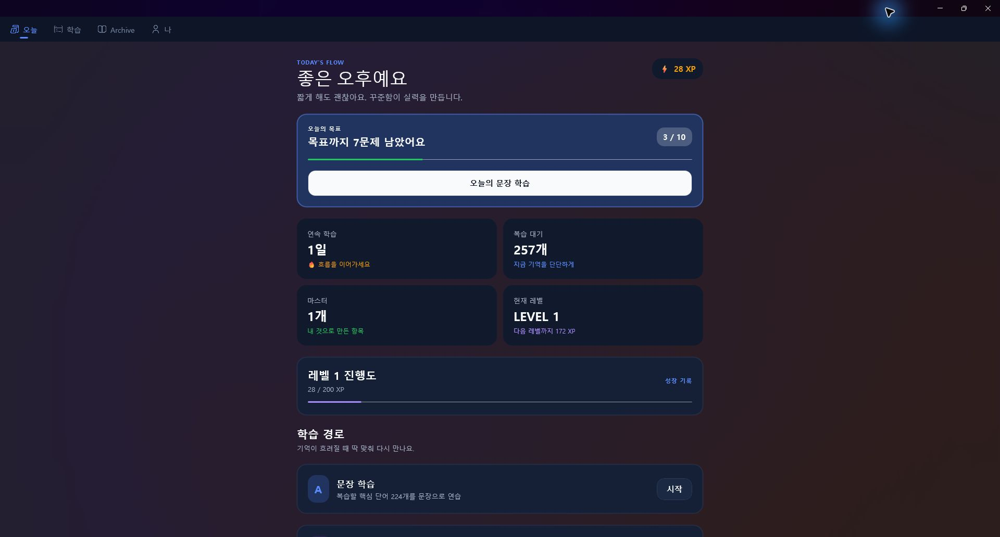
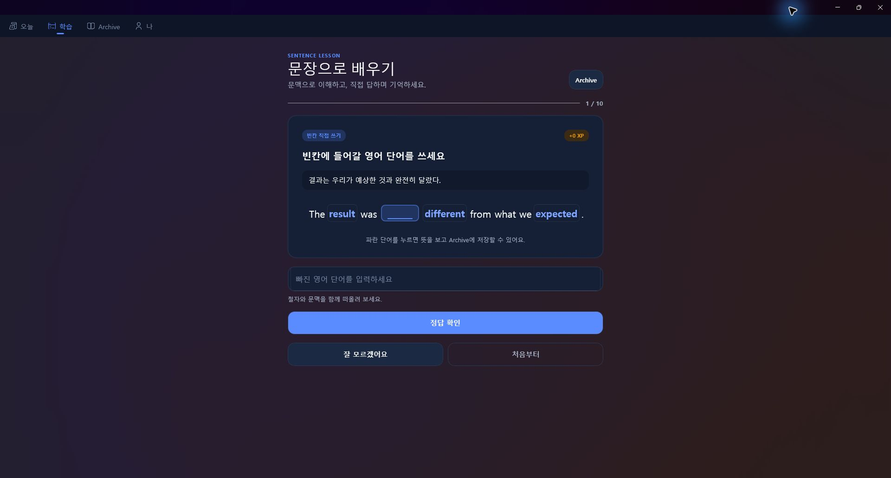
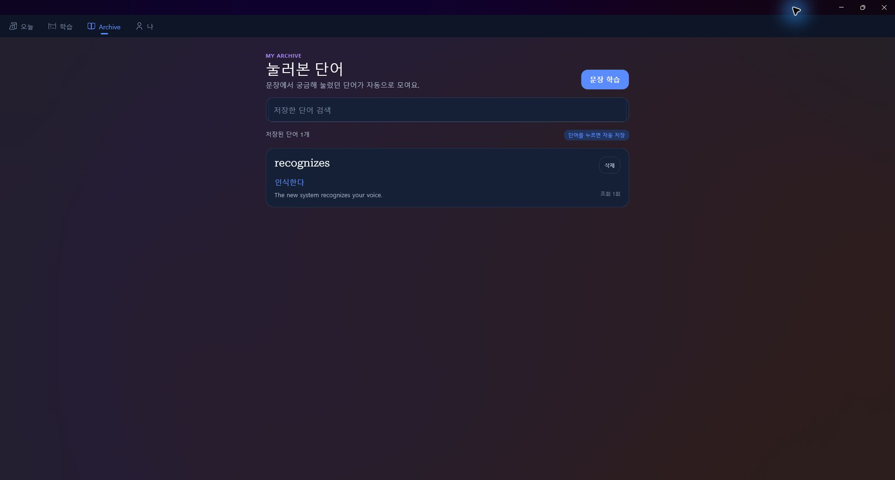
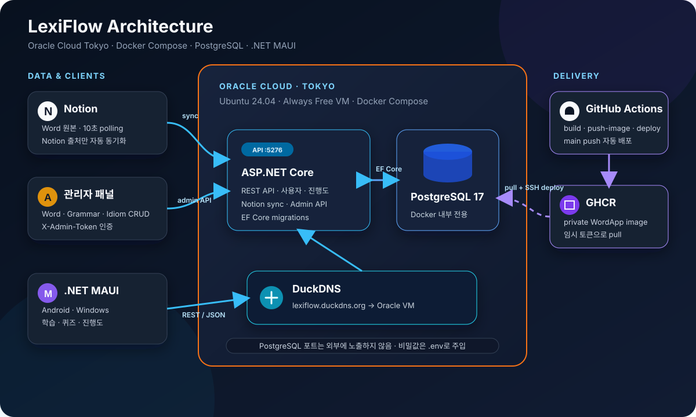
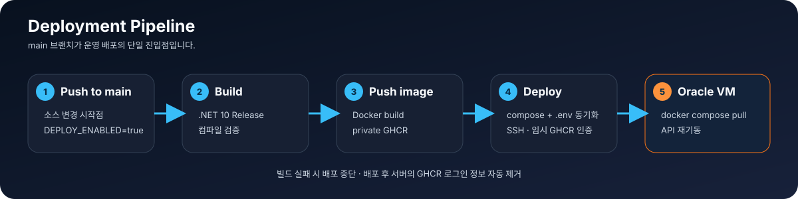

# LexiFlow

> **Lexicon + Flow** — 머릿속 단어들이 자연스럽게 흘러나오는 상태.

Notion과 자체 관리자 패널을 데이터 원본으로 쓰는 풀스택 영어 학습 앱입니다. 핵심 학습 경험은 **문장 뜻 고르기와 빈칸 직접 쓰기**이며, 문장 속 파란 단어를 누르면 뜻을 확인하고 개인 Archive에 저장할 수 있습니다. 서버는 단어·문법·숙어 콘텐츠와 학습 진행도를 동기화하고, .NET MAUI 앱은 오늘의 목표·XP·레벨·연속 학습일을 하나의 흐름으로 보여줍니다.

<p align="left">
  
  
  
  
  
  
  
</p>

---

## 📸 실제 앱 화면

아래 이미지는 목업이 아닌 **Windows용 LexiFlow 실제 실행 화면**입니다.

<p align="center">
  
  <br>
  <sub>오늘 — 목표, XP, 복습 대기, 레벨 진행도를 한눈에 확인</sub>
</p>

<p align="center">
  
  <br>
  <sub>문장 학습 — 뜻 고르기와 빈칸 쓰기, 문장 속 단어 즉시 조회</sub>
</p>

<p align="center">
  
  <br>
  <sub>Archive — 궁금해서 눌러 본 단어와 문맥을 자동 저장</sub>
</p>

---

## ✨ 주요 특징

- **문장 중심 학습** — 매 세션 10문제를 무작위로 구성하고, 문장 뜻 고르기와 빈칸 직접 쓰기를 번갈아 제공
- **틀린 문장 다시 만나기** — 오답은 학습 큐 뒤로 다시 보내 정답을 맞힐 때까지 자연스럽게 반복
- **클릭해서 뜻 보기 + Archive** — 문장 속 파란 단어를 누르면 한국어 뜻을 바로 보여주고 사용자별 로컬 Archive에 문맥·조회 횟수와 함께 저장
- **게임형 성장 흐름** — 오늘의 목표, XP, 레벨, 연속 학습일, 복습 대기를 홈에서 추적
- **보조 학습 콘텐츠** — 서버의 단어·문법·숙어 데이터를 목록과 복습 화면에서 함께 활용
- **단어는 Notion + 관리자 패널 하이브리드** — Notion에서 관리하던 단어는 그대로 자동 동기화되고, 관리자 패널로 넣은 단어는 동기화가 건드리지 않음
- **문법/숙어는 관리자 패널 전용** — Notion 연동 없이 웹 관리자 패널에서 직접 추가·수정·삭제
- **관리자 웹 패널** — 서버에 내장된 정적 웹 페이지(`/admin/`)에서 토큰 인증 후 콘텐츠 CRUD
- **스페이스드 리피티션 + 스트릭** — 마지막 복습 시각과 진행 상태를 기반으로 복습 대상을 골라주고, 연속 학습일수를 추적
- **크로스플랫폼 앱** — .NET MAUI로 Android / Windows 지원
- **컨테이너 배포** — Docker Compose로 API와 DB를 한 번에 실행, 시크릿은 `.env`로 분리
- **클라우드 호스팅 + CI/CD** — Oracle Cloud에 배포, push 한 번으로 빌드·이미지·compose 동기화·배포까지 자동화

---

## 🏗️ 아키텍처

데이터는 두 갈래로 서버에 들어옵니다: Notion(단어만, polling)과 관리자 패널(단어/문법/숙어, 직접 입력). 서버와 데이터베이스는 **Oracle Cloud**에 컨테이너로 배포되어 있습니다.

<p align="center">
  
</p>

| 계층 | 역할 | 위치 |
| --- | --- | --- |
| **Notion** | 단어(Word) 콘텐츠의 선택적 원본 | 외부 SaaS |
| **관리자 패널** | 단어(Manual)/문법/숙어를 직접 추가·수정·삭제 | 서버 내장 웹 페이지 |
| **서버 (Web API)** | Notion 동기화, 관리자 CRUD, 앱에 REST API 제공 | Oracle Cloud |
| **PostgreSQL** | 서버가 읽고 쓰는 저장소 | Oracle Cloud |
| **MAUI 앱** | 문장 학습, 진행도·XP, 사용자별 로컬 Archive를 제공 | 사용자 기기 |

> **설계 원칙:** 계정·콘텐츠·서버 진행도는 REST API를 통해서만 다루고, 앱이 DB나 Notion에 직접 접근하지 않습니다. 문장 카탈로그와 개인 Archive·XP 같은 기기 전용 상태는 MAUI `Preferences`에 사용자별로 분리해 저장합니다.

> **클라우드 배포의 이점:** 서버가 클라우드에서 24시간 실행되므로, 개인 PC를 켜두지 않아도 됩니다. 앱은 와이파이·LTE 등 네트워크 환경과 무관하게 언제 어디서든 서버에 접속할 수 있습니다.

### 콘텐츠별 데이터 소스

| 콘텐츠 | 원본 | 동기화 방식 |
| --- | --- | --- |
| **Word** | Notion + 관리자 패널 (하이브리드) | `Source` 필드로 구분. Notion 출처(`Source=Notion`)만 자동 동기화 대상, 관리자로 넣은 항목(`Source=Manual`)은 절대 건드리지 않음 |
| **Grammar** | 관리자 패널 전용 | 동기화 없음, 관리자 API로 직접 CRUD |
| **Idiom** | 관리자 패널 전용 | 동기화 없음, 관리자 API로 직접 CRUD |

Notion API는 변경 알림(webhook)을 제공하지 않기 때문에, 서버가 `WordSyncService`(`BackgroundService`)로 **10초마다 Notion을 폴링**하고 `Source=Notion`인 기존 단어와 비교해 갱신·삭제합니다. Notion에서 삭제된 단어는 DB에서도 제거되지만, 관리자 패널로 넣은 단어는 영향받지 않습니다.

---

## 🔐 관리자 패널

서버가 정적으로 서빙하는 웹 페이지로, 별도 앱 재빌드 없이 브라우저에서 바로 콘텐츠를 관리할 수 있습니다.

- **접속**: `http://lexiflow.duckdns.org:5276/admin/`
- **인증**: 최초 접속 시 관리자 토큰을 입력하면 세션 동안 저장되어, 이후 요청에 `X-Admin-Token` 헤더로 자동 첨부됩니다. 토큰은 서버의 `Admin:Token` 설정(환경변수 `Admin__Token`)과 일치해야 합니다.
- **탭 구성**: 단어 / 문법 / 숙어 — 각각 목록 조회, 추가, 수정, 삭제 지원
- **Notion 출처 단어는 읽기 전용** — 목록에서 흐리게 표시되며 수정·삭제 버튼이 비활성화됩니다. Notion 쪽에서 고치지 않고 여기서 고쳐도 다음 동기화 때 되돌아가기 때문입니다.

관리자 API 자체(`/admin/api/words`, `/admin/api/grammars`, `/admin/api/idioms`)도 동일한 토큰으로 보호되며, `curl`로 직접 호출할 수도 있습니다.

---

## 🛠️ 기술 스택

**클라이언트**
- .NET MAUI 10.0 — 크로스플랫폼 UI (Android / Windows)
- CommunityToolkit.Mvvm — MVVM(ObservableObject, RelayCommand)
- HttpClient — REST API 통신
- Plugin.LocalNotification — 복습 리마인드 알림

**서버**
- ASP.NET Core Web API — REST 엔드포인트 + 관리자 CRUD API
- Entity Framework Core + Npgsql — ORM, PostgreSQL 마이그레이션
- BackgroundService — Notion 단어 동기화 워커
- BCrypt.Net — 비밀번호 해시
- Notion API — 단어(Word) 데이터 소스 연동
- 정적 파일(HTML/CSS/JS, 빌드 스텝 없음) — 관리자 패널 UI

**데이터 / 인프라**
- PostgreSQL 17 — 데이터 저장
- Docker & Docker Compose — 컨테이너 배포, 시크릿은 `.env`로 분리

---

## 📁 프로젝트 구조

```
LexiFlow/
├── Server/                              # ASP.NET Core Web API
│   ├── WordApp/
│   │   ├── Controllers/
│   │   │   ├── WordsController.cs           # GET /words (공개)
│   │   │   ├── GrammarController.cs          # GET /grammars (공개)
│   │   │   ├── IdiomController.cs            # GET /idioms (공개)
│   │   │   ├── UserController.cs             # 회원가입/로그인/탈퇴
│   │   │   ├── ProgressController.cs         # 단어 진행도
│   │   │   ├── GrammarProgressController.cs  # 문법 진행도
│   │   │   ├── IdiomProgressController.cs    # 숙어 진행도
│   │   │   ├── AdminWordsController.cs       # 관리자 단어 CRUD (토큰 보호)
│   │   │   ├── AdminGrammarsController.cs    # 관리자 문법 CRUD (토큰 보호)
│   │   │   └── AdminIdiomsController.cs      # 관리자 숙어 CRUD (토큰 보호)
│   │   ├── Auth/
│   │   │   └── AdminAuthFilter.cs            # X-Admin-Token 검증 필터
│   │   ├── Services/
│   │   │   ├── NotionService.cs              # Notion API 호출 + 파싱 (Word 전용)
│   │   │   └── WordSyncService.cs            # 단어 동기화 (Source=Notion만 대상)
│   │   ├── Data/
│   │   │   └── AppDbContext.cs               # EF Core DbContext
│   │   ├── Models/                           # Word/Grammar/Idiom + 각 Progress 엔티티
│   │   ├── wwwroot/admin/                    # 관리자 패널 정적 웹 페이지
│   │   └── Program.cs                        # 앱 시작점 (DI, 미들웨어)
│   ├── Dockerfile                       # 멀티스테이지 빌드
│   ├── docker-compose.yml               # API + PostgreSQL (${VAR}로 시크릿 분리)
│   └── .env.example                     # 로컬 .env 템플릿 (실제 값은 gitignore)
│
└── Application/                         # .NET MAUI 클라이언트
    └── LexiFlow/
        ├── Services/
        │   ├── ApiService.cs                 # 서버 API 호출
        │   ├── SentenceCatalogService.cs     # 뜻 고르기/빈칸 쓰기 문장 카탈로그
        │   ├── ArchiveService.cs             # 눌러 본 단어를 사용자별 로컬 저장
        │   ├── LearningMetricsService.cs     # 일일 목표, XP, 레벨 지표
        │   ├── ReviewScheduler.cs            # 제네릭 스페이스드 리피티션
        │   ├── StreakService.cs              # 연속 학습일수 추적
        │   └── NotificationService.cs        # 복습 리마인드 알림
        ├── ViewModels/                   # Words/Grammar/Idiom ViewModel
        ├── Views/                        # 홈/문장 학습/Archive/계정 + 보조 콘텐츠
        ├── Models/                       # 콘텐츠, 문장 문제, Archive 모델
        └── Platforms/Android/
            └── AndroidManifest.xml       # 권한, 네트워크 설정
```

---

## 🔌 API

### 공개 조회

| 메서드 | 엔드포인트 | 설명 |
| --- | --- | --- |
| `GET` | `/words` | 전체 단어 목록 조회 (`?status=`로 필터) |
| `GET` | `/grammars` | 전체 문법 목록 조회 (`?status=`로 필터) |
| `GET` | `/idioms` | 전체 숙어/구동사 목록 조회 (`?status=`로 필터) |

**응답 예시** (`GET /words`)

```json
[
  {
    "id": "39021ce8-5244-...",
    "english": "allocate",
    "meaning": "할당하다, 배분하다",
    "status": "미분류",
    "example": "The manager will allocate resources to each team.",
    "source": "Notion"
  }
]
```

### 사용자 / 진행도

| 메서드 | 엔드포인트 | 설명 |
| --- | --- | --- |
| `POST` | `/users` | 회원가입 |
| `POST` | `/users/login` | 로그인 |
| `GET` / `PATCH` / `DELETE` | `/users/{id}` | 조회 / 비밀번호 변경 / 탈퇴 |
| `GET` / `POST` | `/users/{userId}/progress` | 단어 진행도 조회 / 리뷰 결과 반영 |
| `GET` / `POST` | `/users/{userId}/grammar-progress` | 문법 진행도 조회 / 반영 |
| `GET` / `POST` | `/users/{userId}/idiom-progress` | 숙어 진행도 조회 / 반영 |

### 관리자 (토큰 인증 필요, `X-Admin-Token` 헤더)

| 메서드 | 엔드포인트 | 설명 |
| --- | --- | --- |
| `GET`/`POST`/`PUT`/`DELETE` | `/admin/api/words` | 단어 CRUD. Notion 출처 행은 PUT/DELETE 시 409 |
| `GET`/`POST`/`PUT`/`DELETE` | `/admin/api/grammars` | 문법 CRUD |
| `GET`/`POST`/`PUT`/`DELETE` | `/admin/api/idioms` | 숙어 CRUD |

---

## 🚀 시작하기

### 사전 요구사항

- [.NET 10 SDK](https://dotnet.microsoft.com/download)
- [Docker Desktop](https://www.docker.com/products/docker-desktop/) (컨테이너 실행 시)
- Notion API 토큰 및 단어 데이터베이스 (Word 동기화를 쓸 경우)

### 1. 환경변수(.env) 준비

시크릿은 코드/이미지에 포함되지 않고 `.env` 파일로 주입됩니다. `docker-compose.yml`과 같은 폴더에 `.env`를 만듭니다.

```bash
cd Server
cp .env.example .env
```

`.env` 내용을 채웁니다 (커밋되지 않음):

```
DB_PASSWORD=원하는-강력한-비밀번호
NOTION_TOKEN=ntn_xxx
NOTION_WORDS_DATA_SOURCE_ID=xxxxxxxx-xxxx-xxxx-xxxx-xxxxxxxxxxxx
ADMIN_TOKEN=관리자-패널-접속-토큰
```

### 2. 서버 실행 (Docker — 권장)

Docker Compose를 사용하면 API 서버와 PostgreSQL을 한 번에 실행합니다. 대상 머신에 PostgreSQL을 설치할 필요가 없습니다.

```bash
cd Server
docker compose up --build
```

- API: `http://localhost:5276`
- 관리자 패널: `http://localhost:5276/admin/`
- PostgreSQL: Compose 내부 전용 `db:5432` (호스트에 미노출)

동작 확인:

```bash
curl http://localhost:5276/words
```

### 3. 서버 실행 (로컬 — Docker 없이)

로컬에 PostgreSQL이 설치되어 있다면, `appsettings.json`에는 실제 값을 넣지 말고 `dotnet user-secrets`로 주입합니다 (최초 1회):

```bash
cd Server/WordApp
dotnet user-secrets set "ConnectionStrings:Default" "Host=localhost;Port=5432;Database=worddb;Username=worddb;Password=..."
dotnet user-secrets set "Notion:Token" "ntn_xxx"
dotnet user-secrets set "Notion:WordsDataSourceId" "xxxxxxxx-xxxx-xxxx-xxxx-xxxxxxxxxxxx"
dotnet user-secrets set "Admin:Token" "관리자-패널-접속-토큰"

dotnet run --urls "http://0.0.0.0:5276"
```

> 외부 기기(모바일)에서 접근하려면 `localhost`가 아닌 `0.0.0.0`에 바인딩해야 합니다.

### 4. 클라이언트 실행

`ApiService.cs`에서 실행 환경에 맞게 서버 주소를 설정합니다.

```csharp
_http = new HttpClient(handler)
{
    BaseAddress = new Uri("http://lexiflow.duckdns.org:5276/")
};
```

| 실행 환경 | 서버 주소 |
| --- | --- |
| Windows 데스크톱 | `localhost` |
| Android 에뮬레이터 | `10.0.2.2` |
| 실기기 / 원격 접속 | PC의 LAN IP 또는 `lexiflow.duckdns.org` |

```bash
cd Application/LexiFlow

# Windows
dotnet build -t:Run -f net10.0-windows10.0.19041.0

# Android (에뮬레이터 또는 연결된 기기)
dotnet build -t:Run -f net10.0-android
```

### 5. Android APK 빌드 (배포용)

```bash
dotnet publish -f net10.0-android -c Release
```

서명된 APK가 생성됩니다:

```
bin/Release/net10.0-android/publish/io.leeple.lexiflow-Signed.apk
```

> 실기기에 사이드로딩 시, 삼성 기기는 **설정 → 보안 → 자동 차단**을 해제해야 설치됩니다.

### 6. Windows 배포용 빌드

Windows는 실행 파일과 의존 DLL을 담은 **폴더 형태**로 배포합니다.

```bash
dotnet publish -f net10.0-windows10.0.19041.0 -c Release -p:WindowsPackageType=None
```

결과물 위치:

```
bin/Release/net10.0-windows10.0.19041.0/publish/
```

이 폴더 안의 `LexiFlow.exe`가 실행 파일입니다. **폴더 전체를 압축(zip)하여 배포**하고, 받는 쪽에서 압축을 푼 뒤 `LexiFlow.exe`를 실행합니다. (`.exe` 단독으로는 의존 DLL이 없어 실행되지 않습니다.)

> **참고**
> - 실행하려면 대상 PC에 **.NET 10 데스크톱 런타임**이 필요합니다.
> - MAUI Windows는 단일 파일 배포(`PublishSingleFile`)가 불안정하므로, 폴더 배포를 권장합니다.

---

## ⚙️ 설정

시크릿은 더 이상 `appsettings.json`에 커밋하지 않습니다. Docker 환경은 `.env`(위 "시작하기" 참고), 로컬 비-Docker 환경은 `dotnet user-secrets`를 씁니다.

| 항목 | 환경변수 | 설명 |
| --- | --- | --- |
| DB 연결 문자열 | `ConnectionStrings__Default` | PostgreSQL 연결 문자열 |
| DB 비밀번호 | `DB_PASSWORD` | `docker-compose.yml`에서 `${DB_PASSWORD}`로 참조 |
| Notion API 토큰 | `Notion__Token` | Notion 통합(integration) 토큰. Word 동기화에만 사용 |
| Notion Data Source ID | `Notion__WordsDataSourceId` | 단어 데이터베이스 식별자 |
| 관리자 패널 토큰 | `Admin__Token` | `/admin` 패널·API 접근용 공유 비밀번호 |
| 동기화 주기 | — | `WordSyncService`에 고정값 10초 |

> Docker 환경에서는 연결 문자열의 호스트로 서비스 이름(`Host=db`)을 사용합니다. 컨테이너 간에는 서비스 이름으로 통신합니다.

---

## ☁️ 배포 (Oracle Cloud)

이 프로젝트는 Docker 컨테이너로 패키징되어 **Oracle Cloud**에 배포됩니다. 서버와 데이터베이스가 클라우드에서 상시 실행되므로, 클라이언트 앱은 네트워크 환경과 무관하게 언제든 접속할 수 있습니다.

| 운영 항목 | 현재 구성 |
| --- | --- |
| 리전 / VM | Japan East (Tokyo) · Ubuntu 24.04 · Always Free |
| 공개 주소 | `http://lexiflow.duckdns.org:5276` |
| 런타임 | Docker Compose (`api` + `postgres:17-alpine`) |
| 데이터베이스 | PostgreSQL 17 · 호스트 포트 미노출 |
| 배포 | GitHub Actions → private GHCR → SSH 배포 |
| 이전 서버 | GCP 서울 VM 및 부팅 디스크 제거 완료 (2026-09-17) |

**배포 흐름**

<p align="center">
  
</p>

**로컬에서 먼저 검증하는 이유**

로컬에서 `docker compose up`으로 완전히 동작하는 것을 확인한 뒤 클라우드에 올립니다. 로컬에서 검증된 동일한 컨테이너 이미지가 클라우드에서도 그대로 실행되므로, "로컬에선 되는데 서버에선 안 되는" 문제를 최소화합니다.

**클라이언트 설정**

배포 후, 앱의 `ApiService.cs`에서 `BaseAddress`를 배포된 서버 주소로 지정합니다.

```csharp
_http = new HttpClient(handler)
{
    BaseAddress = new Uri("http://lexiflow.duckdns.org:5276/")
};
```

> **네트워크 확인 팁:** 앱을 다시 빌드하기 전에, 기기의 브라우저에서 `http://lexiflow.duckdns.org:5276/words`에 접속해 JSON이 반환되는지 먼저 확인하세요. 이 한 번의 테스트로 문제가 네트워크에 있는지 앱 코드에 있는지 빠르게 구분할 수 있습니다.

---

## 🔄 CI/CD (GitHub Actions)

`main` 브랜치에 push하면 **빌드 검증 → 이미지 생성 → compose 동기화 → 서버 배포**가 자동으로 실행됩니다. 손으로 SSH 접속해 배포하거나 compose 파일을 옮기던 과정을 자동화했습니다.

| 단계 | 역할 |
| --- | --- |
| **build** | .NET 프로젝트가 정상 빌드되는지 검증 (CI) |
| **push-image** | Docker 이미지를 빌드해 GitHub Container Registry(ghcr.io)에 업로드 |
| **deploy** | `docker-compose.yml`을 VM으로 scp 동기화 → GitHub Secrets로 `.env` 재생성 → 이미지 pull → 컨테이너 재기동 (CD) |

각 단계는 `needs`로 연결되어, 앞 단계가 성공해야 다음 단계가 실행됩니다. 빌드가 깨지면 배포까지 진행되지 않습니다.

**배포 전략** — GitHub Actions가 이미지를 빌드해 레지스트리(ghcr.io)에 올리고, VM은 그 이미지를 pull만 하여 실행합니다. 빌드(러너)와 실행(VM)이 분리되어 VM이 빌드 부담을 지지 않습니다. `docker-compose.yml`은 시크릿을 담지 않으므로(`${VAR}` 참조만 있음) 매 배포마다 그대로 VM에 동기화해도 안전하고, 실제 값은 GitHub Secrets에서 그때그때 VM의 `.env`로 주입됩니다.

### 워크플로우

`.github/workflows/ci.yml`

```yaml
name: CI/CD
on:
  push:
    branches: [ main ]

env:
  IMAGE: ghcr.io/<owner>/<repo>/wordapp   # 반드시 소문자

jobs:
  build:
    runs-on: ubuntu-latest
    steps:
      - uses: actions/checkout@v4
      - uses: actions/setup-dotnet@v4
        with:
          dotnet-version: '10.0.x'
      - run: dotnet build Server/WordApp/WordApp.csproj -c Release

  push-image:
    needs: build
    runs-on: ubuntu-latest
    permissions:
      contents: read
      packages: write
    steps:
      - uses: actions/checkout@v4
      - uses: docker/login-action@v3
        with:
          registry: ghcr.io
          username: ${{ github.actor }}
          password: ${{ secrets.GITHUB_TOKEN }}
      - uses: docker/build-push-action@v5
        with:
          context: ./Server
          push: true
          tags: ${{ env.IMAGE }}:latest

  deploy:
    needs: push-image
    if: vars.DEPLOY_ENABLED == 'true'
    runs-on: ubuntu-latest
    permissions:
      contents: read
      packages: read
    steps:
      - uses: actions/checkout@v4

      - name: Sync docker-compose.yml to VM
        uses: appleboy/scp-action@v0.1.7
        with:
          host: ${{ secrets.VM_HOST }}
          username: ${{ secrets.VM_USER }}
          key: ${{ secrets.VM_SSH_KEY }}
          source: "Server/docker-compose.yml"
          target: "~/LexiFlow/Server"
          strip_components: 1

      - name: Deploy to VM
        uses: appleboy/ssh-action@v1.0.3
        env:
          DB_PASSWORD: ${{ secrets.DB_PASSWORD }}
          NOTION_TOKEN: ${{ secrets.NOTION_TOKEN }}
          NOTION_WORDS_DATA_SOURCE_ID: ${{ secrets.NOTION_WORDS_DATA_SOURCE_ID }}
          ADMIN_TOKEN: ${{ secrets.ADMIN_TOKEN }}
          GHCR_USER: ${{ github.actor }}
          GHCR_TOKEN: ${{ secrets.GITHUB_TOKEN }}
        with:
          host: ${{ secrets.VM_HOST }}
          username: ${{ secrets.VM_USER }}
          key: ${{ secrets.VM_SSH_KEY }}
          envs: DB_PASSWORD,NOTION_TOKEN,NOTION_WORDS_DATA_SOURCE_ID,ADMIN_TOKEN,GHCR_USER,GHCR_TOKEN
          script: |
            set -e
            cat > ~/LexiFlow/Server/.env <<EOF
            DB_PASSWORD=$DB_PASSWORD
            NOTION_TOKEN=$NOTION_TOKEN
            NOTION_WORDS_DATA_SOURCE_ID=$NOTION_WORDS_DATA_SOURCE_ID
            ADMIN_TOKEN=$ADMIN_TOKEN
            EOF
            cd ~/LexiFlow/Server
            printf '%s' "$GHCR_TOKEN" | docker login ghcr.io -u "$GHCR_USER" --password-stdin
            trap 'docker logout ghcr.io >/dev/null 2>&1 || true' EXIT
            docker compose pull
            docker compose up -d --force-recreate
```

### 사전 설정

**GitHub Secrets** (Settings → Secrets and variables → Actions)

| Secret | 값 |
| --- | --- |
| `VM_HOST` | Oracle Cloud VM의 외부 IP |
| `VM_USER` | SSH 사용자명 |
| `VM_SSH_KEY` | SSH 개인키 전체 |
| `DB_PASSWORD` | PostgreSQL `worddb` 사용자 비밀번호 (기존 볼륨의 실제 값과 동일해야 함) |
| `NOTION_TOKEN` | Notion 통합 토큰 |
| `NOTION_WORDS_DATA_SOURCE_ID` | 단어 Notion 데이터베이스 식별자 |
| `ADMIN_TOKEN` | 관리자 패널 접근 토큰 |

> ghcr.io 인증은 `GITHUB_TOKEN`이 자동 제공되므로 별도 secret이 필요 없습니다.

**SSH 키** — 배포는 GitHub Actions가 VM에 SSH로 접속해 수행합니다. **개인키는 Secret(`VM_SSH_KEY`)에, 공개키는 VM의 `~/.ssh/authorized_keys`에** 둡니다. 로컬에서 `ssh -i <개인키> <user>@<host>`가 되면 Actions에서도 동작합니다.

**DB_PASSWORD 주의사항** — `POSTGRES_PASSWORD`는 PostgreSQL 데이터 볼륨을 **최초 초기화할 때만** 적용됩니다. VM에 데이터가 든 기존 볼륨이 있다면, 시크릿만 바꿔도 실제 DB 비밀번호는 바뀌지 않습니다. 이 경우 `worddb` 역할의 비밀번호도 함께 변경해야 합니다.

### 트러블슈팅

| 증상 | 원인 | 해결 |
| --- | --- | --- |
| `Failed to install dotnet 10.0.9` | .NET 10이 최신이라 정식 채널에 없음 | `dotnet-quality: 'preview'` 추가 |
| `repository name must be lowercase` | ghcr.io 태그에 대문자 불가 | 이미지 이름을 소문자로 지정 |
| `can't connect without a private SSH key` (secret이 `null`) | Secret 이름 불일치 | 워크플로우와 secret 이름 일치 |
| `handshake failed: [none publickey]` | 개인키↔공개키 짝 불일치, 또는 공개키 미등록 | 공개키를 `authorized_keys`에 등록, 로컬 접속으로 검증 |
| API의 DB 인증 실패 | `DB_PASSWORD` 시크릿이 기존 PostgreSQL 볼륨의 실제 비밀번호와 다름 | 시크릿과 `worddb` 역할의 비밀번호를 일치시킴 |

> CD 실패의 대부분은 SSH 키 인증 문제이거나 DB 비밀번호 불일치입니다. 로컬에서 `ssh -i` 접속 테스트로 먼저 검증하세요. 개인키/토큰은 절대 공유·노출하지 않으며, 노출 시 즉시 폐기·재발급합니다.

---

## 📄 라이선스

이 프로젝트는 학습 목적으로 제작되었습니다.

---

<p align="center">
  <sub>Built with .NET MAUI · ASP.NET Core · PostgreSQL · Docker · Oracle Cloud · GitHub Actions</sub>
</p>
