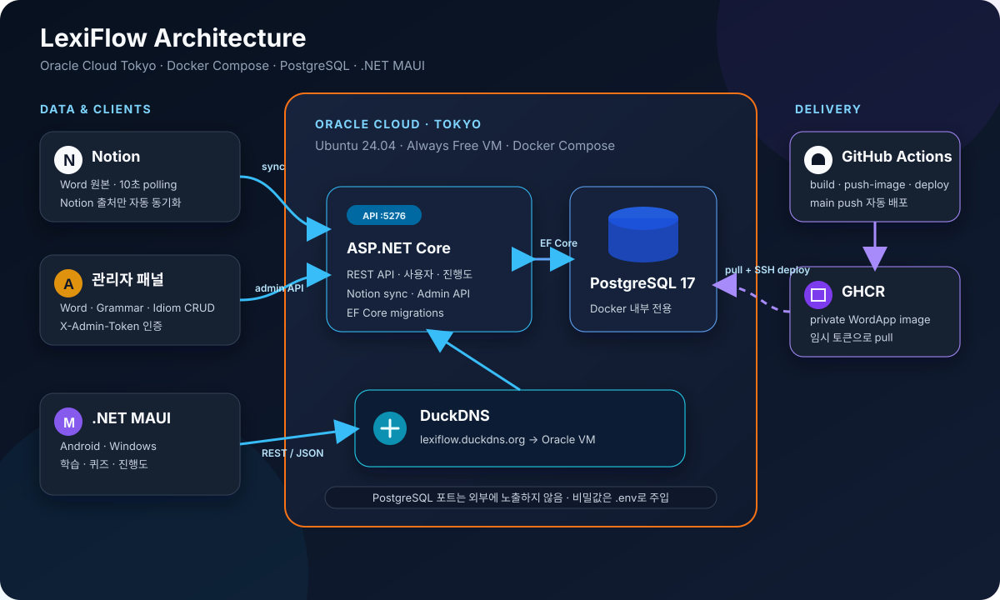
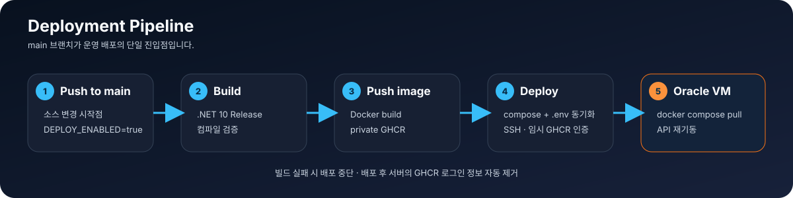

# LexiFlow

> 2026-09-18 운영 서버를 HTTPS·토큰 인증으로 전환했습니다. 구버전 HTTP 앱은 접속할 수 없으므로 1.1 이상 보안 빌드로 업데이트하고 다시 로그인하세요. 1.2는 360단어 기본팩·단어장·오답 집중 복습, 1.3은 차콜·구리색의 compact UI를 제공합니다. [검증·배포 기록](docs/SECURITY-DEPLOYMENT-STATUS.md) · [백업·전환 절차](docs/SECURITY-ROLLOUT.md)

> 일일 암호화 DB 백업(03:00 KST), Oracle Object Storage 30일·서버 7일 보관, 실패·지표 수신 중단 이메일 경보를 구성했습니다. [자동 백업·복구 운영 안내](docs/BACKUP-RUNBOOK.md)

> 이메일 인증 가입·비밀번호 찾기는 로컬 구현 및 검증 중이며 **아직 운영 반영 전**입니다. 전용 발신 도메인·SMTP 설정과 DB 마이그레이션이 필요합니다. [설계·배포 절차](docs/ACCOUNT-RECOVERY.md)

> 1.5.2는 닉네임 입력 없이 **로그인 ID로 전체 계정 자동 랭킹**을 제공합니다. 로그인한 사용자에게 ID·순위·완료 수를 표시하고 공동 1등을 포함한 1등에는 움직이는 크로마 테두리를 적용합니다. 이메일 필드·비밀번호·세션 정보는 비공개입니다. 서버는 랭킹만 분리 적용하며 이메일 가입·복구는 여전히 미배포입니다. [점수·공개 범위](docs/RANKING.md) · [운영 검증·백업 기록](docs/RANKING-DEPLOYMENT-STATUS.md) · [SSH로 DB 접근하는 방법](docs/DATABASE-ACCESS.md)

> 1.5.3은 1등의 크로마 테두리만 유지하고 별도 CHROMA 배지 문구는 제거했습니다.

> 1.6부터 Windows 단일 EXE 안에서 업데이트를 확인·다운로드·재시작 적용할 수 있습니다. 구버전은 업데이터 포함 EXE로 한 번 교체해야 하며, 이후 같은 EXE 경로를 유지합니다. HTTPS·고정 공개키 서명·SHA-256 검증을 통과한 파일만 적용하고 시작 실패 시 이전 EXE로 복구합니다. 강제 다운로드·재시작은 하지 않습니다. [앱 업데이트·배포 운영 안내](docs/APPLICATION-UPDATES.md)

> 2026-10-08 로그인 ID 랭킹 검증: 랭킹 전용 배포본의 격리 PostgreSQL 104개, 클라이언트 46개 검사 통과. 초기 선택 참여·자동 이름 버전과 최신 운영 결과는 배포 기록에 구분해 보관합니다.

> **Lexicon + Flow** — 머릿속 단어들이 자연스럽게 흘러나오는 상태.

Notion과 자체 관리자 패널을 데이터 원본으로 쓰는 풀스택 영어 학습 앱입니다. **단계별 코스에서 뜻 고르기·빈칸 쓰기·문장 순서 맞추기·전체 문장 쓰기**를 연습하고, 문장 속 강조된 단어를 누르면 뜻을 확인하고 개인 Archive에 저장할 수 있습니다. 서버는 단어·문법·숙어 콘텐츠와 학습 진행도를 동기화하고, .NET MAUI 앱은 오늘의 목표·XP·레벨·연속 학습일을 하나의 흐름으로 보여줍니다.

<p align="left">
  
  
  
  
  
  
  
</p>

---

## ✨ 주요 특징

- **360단어 기본 학습팩** — 12개 주제 × 30단어, 각 단어에 품사·내부 난이도·직접 작성한 영문 예문·한국어 번역 제공. 앱에 포함되어 콘텐츠 서버에 연결하지 못해도 사용 가능
- **단계별 학습 코스** — 기본팩만으로 45단계·15유닛. 최대 8문제씩 순차 해제하며 UNIT 4 이후에도 계속 확장. 새 콘텐츠는 기존 단계·최고 별점을 유지하면서 뒤에 추가
- **단어 라이브러리** — ‘단어장’ 탭에서 영어·뜻·예문·주제 즉시 검색, 난이도/주제/학습 상태 복합 필터, 알파벳 정렬, 결과·진도 요약. 상세 화면에서 예문·번역·기기 영어 음성·Archive 저장 지원
- **네 가지 문제 유형** — 뜻 고르기, 빈칸 쓰기, 단어 타일로 어순 맞추기, 영어 문장 전체 쓰기. 어순/쓰기 집중 연습도 바로 선택 가능
- **집중하기 쉬운 학습 화면** — 전체 유닛 수·마지막 유닛 번호 표시, 전체 목록에서 바로 선택, 이전/다음 이동, 스크롤 가능한 유닛 탭과 선택 탭 자동 노출. 유닛별 경로와 단계 미리보기, 넓은 창의 2열/좁은 창의 1열 배치, 고정 진행도·확인 버튼. 답을 입력하거나 선택하면 확인 버튼이 활성화되고, 어순 타일은 선택해도 나머지 위치를 유지
- **별점과 재도전** — 오답까지 모두 해결하면 다음 단계가 열림. 첫 시도 정답률 90%/70% 이상은 별 3개/2개, 나머지는 별 1개. 힌트 사용 답은 첫 시도 점수에서 제외하고 재도전 최고 별점 유지
- **새 문장과 간격 복습** — 서버+내장 예문에서 매 세션 10문제 구성. 새 문장은 첫 순회 중 중복을 피하고, 복습 시각이 된 문장은 최대 30%까지 다시 선정
- **모르는 단어 우선 출제** — Archive에 저장한 단어와 오답·`Learning` 진행도의 단어를 다음 학습에서 먼저 선정
- **오답 집중 복습** — 오답은 학습 큐 뒤로 재출제하고 완료 화면에서 이번 오답만 재도전. 별도 오답 코스는 두 번 연속 도움 없이 맞히면 졸업하며, 기기에 계정별로 복습 간격을 저장
- **클릭해서 뜻 보기 + Archive** — 문장 속 강조된 단어를 누르면 한국어 뜻을 바로 보여주고 사용자별 로컬 Archive에 문맥·조회 횟수와 함께 저장
- **게임형 성장 흐름** — 오늘의 목표, XP, 레벨, 연속 학습일, 복습 대기를 홈에서 추적
- **로그인 ID 자동 랭킹** — 별도 닉네임 없이 `Mastered` 단어·문법·표현 수로 TOP 50·내 순위 제공. 0점 계정·동점 지원, 1등은 움직이는 크로마 테두리. 로그인 ID는 공개되며 이메일 필드·인증 정보는 비공개. 기기 전용 XP·기본팩·문장 코스는 제외하며 부정행위 검증된 성적표는 아님
- **보조 학습 콘텐츠** — 서버의 단어·문법·숙어 데이터를 목록과 복습 화면에서 함께 활용
- **단어는 Notion + 관리자 패널 하이브리드** — Notion에서 관리하던 단어는 그대로 자동 동기화되고, 관리자 패널로 넣은 단어는 동기화가 건드리지 않음
- **문법/숙어는 관리자 패널 전용** — Notion 연동 없이 웹 관리자 패널에서 직접 추가·수정·삭제
- **관리자 웹 패널** — 서버에 내장된 정적 웹 페이지(`/admin/`)에서 토큰 인증 후 콘텐츠 CRUD
- **스페이스드 리피티션 + 스트릭** — 마지막 복습 시각과 진행 상태를 기반으로 복습 대상을 골라주고, 연속 학습일수를 추적
- **크로스플랫폼 앱** — .NET MAUI로 Android / Windows 지원
- **컨테이너 배포** — Docker Compose로 API와 DB를 한 번에 실행, 시크릿은 `.env`로 분리
- **클라우드 호스팅 + CI/CD** — Oracle Cloud에 배포, 빌드·보안 테스트·이미지 생성을 자동화하고, 별도 승인 변수로 운영 배포 제어

기본팩은 일상 동작, 집과 생활, 음식과 요리, 사람과 감정, 시간과 계획, 날씨와 자연, 여행과 이동, 쇼핑과 금융, 학교와 학습, 일과 업무, 디지털 생활, 사회와 환경의 12개 주제로 구성됩니다. 난이도 `기초/일상/확장`은 앱 내부 분류이며 공인 CEFR 판정이 아닙니다. 서버 단어와 표제어가 겹치면 기존 서버 ID·뜻·예문을 우선 보존하므로 실제 총 단어 수는 단순 합계보다 적을 수 있습니다.

기본팩 단어 진도, 코스 별점, 오답 기록, Archive는 **이 기기에 계정별로 저장**되며 기기 간 자동 동기화하지 않습니다. 기존 서버 단어의 진도만 API에 저장합니다. 서버 저장 실패는 화면에 알리며 자동 재전송하지 않습니다. 계정 삭제 시 해당 계정의 로컬 학습 기록도 제거합니다. 이 콘텐츠 확장은 서버 DB 마이그레이션이나 유료 AI API 없이 앱 업데이트로 제공됩니다.

2026-10-02 Windows 실제 실행에서 서버와 병합한 578단어·57단계·19유닛을 확인했으며 기존 완료 10단계와 별점을 유지했습니다. 서버 콘텐츠 및 기기에 저장된 기존 단계 구성에 따라 총수는 달라집니다. 코스·오답·Archive 등의 큰 기록은 작은 청크로 저장하고, 저장 도중 실패하면 이전의 완전한 기록을 유지합니다.

1.4의 Windows 개인용 앱은 **공식 Sign in with ChatGPT**로 본인의 ChatGPT 플랜을 연결하여 문장 전체 쓰기를 판별합니다. 예문과 표현이 달라도 의미가 같으면 인정하도록 요청하며, 가벼운 문법·철자 문제는 교정 제안과 함께 인정합니다. 큰 문법 문제, 의미 차이, 판단 보류를 구분하고 내 답안·다듬은 문장·가능한 모범답안을 따로 표시합니다. AI 판단은 확정적인 정답 보장이 아닙니다. 뜻 고르기·단어 빈칸·어순 문제의 기존 판정은 유지합니다.

연결 방법: `나 → 문장 쓰기 · ChatGPT → Continue with ChatGPT`에서 기본 브라우저의 OpenAI 로그인·사용량 공유 동의를 **직접** 마친 뒤 문장 쓰기를 사용합니다. **1.4.1부터 GPT-6.1 Sol(`gpt-6.1-sol`) 고정**이며 모델 선택 UI·목록 조회를 채점의 선행 조건으로 사용하지 않습니다. 해당 계정에서 모델 사용이 거절되면 안전한 오류를 표시하고 다른 모델·API 키로 전환하거나 자동 재시도하지 않습니다. API 키나 별도 API 요금 결제는 사용하지 않으며, ChatGPT 플랜의 사용량·정책·일시 제한이 적용됩니다. Pro도 무제한 처리로 가정하지 않습니다. 연결 실패·사용량 제한·시간 초과·중단된 응답·판단 보류는 답안을 유지하고 오답/XP/진도를 기록하지 않습니다. 연결하지 않으면 전체 문장 쓰기의 AI 확인은 사용할 수 없습니다.

문제의 번역·예문·작성한 답안만 사용자 PC에서 공식 OpenAI 응답 엔드포인트로 전송합니다(`store: false`, 도구·웹 검색 없음). 개인정보를 답안에 입력하지 마세요. OAuth 등록·계정별 토큰은 기기 보호 저장소에 저장하고, PKCE·state·nonce·ID 토큰 서명/발급자/대상/만료 검증과 회전 refresh token 직렬화를 적용합니다. ChatGPT 토큰을 LexiFlow 서버, `Preferences`, 로그에 보내거나 기존 Codex 로그인에서 가져오지 않습니다. `store: false`가 OpenAI 측 모든 데이터 처리·보관의 부재를 보장하는 것은 아닙니다.

이 연결은 **본인 PC의 로컬 사용 범위**입니다. 현재 OAuth 공유 프리뷰가 유료·원격 호스팅 제품의 무승인 사용을 허용하는 것은 아닙니다. 상용화·서버 경유·다른 사용자 대상 배포는 별도 검토가 필요합니다. [공식 빠른 시작](https://developers.openai.com/siwc/quickstart), [모델·응답 계약](https://developers.openai.com/siwc/token-sharing-open-source/models-and-inference), [프리뷰 제한](https://developers.openai.com/siwc/token-sharing-open-source/preview-limitations)을 참고하세요. 실제 로그인·AI 응답 품질은 연결한 계정과 모델로 별도 확인해야 합니다.

학습 로직 검증: `dotnet run --project Tests/LearningChecks` (서버 예문 검증 포함: 뒤에 `-- --live`). 콘텐츠 무결성, 45단계 구성, 단계 잠금, 별점 보존, 계정 분리, 문제 유형, 채점, 비반복 출제, 오답 간격 복습, 라이브러리 검색을 검사합니다. `dotnet run --project Tests/ClientSecurityChecks`는 인증·기본팩 로컬 저장·통신 실패 처리를 네트워크 없이 검사합니다.

ChatGPT 연결은 `dotnet run --project Tests/ChatGptAuthChecks`, 채점 응답 검증은 `dotnet run --project Tests/ChatGptWritingChecks`로 검사합니다. 가짜 HTTP·보호 저장소·토큰 공급자를 사용하므로 실제 로그인이나 모델 호출은 하지 않습니다. 운영 서버의 설정·DB·메일·백업 작업과 분리되어 있습니다.

2026-10-07 1.4.1 로컬 검사: 기존 학습 56개, 클라이언트 보안 35개, ChatGPT 인증 17개, 응답 검증 68개(총 176개) 통과. Windows Release 단일 EXE 게시 성공. 모델 목록 없이 고정 모델로 요청하는 동작과 모델 거절 시 대체 호출하지 않는 동작을 포함합니다. 이 오프라인 검사는 실제 모델의 의역 판별 정확도나 사용자의 계정 이용 가능 여부를 보장하지 않습니다.

1.4.2는 응답 검증 실패를 `[진단: WF_…]`로 구분합니다. 응답 형식(`WF_MEDIA_TYPE`), 미완료 스트림(`WF_NO_COMPLETION`), 채점 JSON(`WF_JSON`), 필수 항목(`WF_FIELDS`), 피드백·수정 설명 검증(`WF_CONTENT`) 등의 코드만 표시하며 답안·토큰·서버 응답 원문을 로그에 저장하지 않습니다. 기존의 완료 응답·채점 검증과 실패 시 기록하지 않는 정책은 유지합니다. 사용자 오류 캡처만으로 실제 실패 원인은 확정되지 않았으며, 새 빌드에서 재현된 진단 코드가 필요합니다. 오프라인 응답 검증은 70/70 통과했고 Windows Release 단일 EXE 게시에 성공했습니다. 실제 계정의 AI 응답 성공은 아직 확인하지 않았습니다.

1.4.3은 `WF_MEDIA_TYPE` 재현 보고에 따른 스트림 호환성 보완입니다. 헤더가 없거나 `application/json`·`text/plain`·`application/octet-stream`인 경우도 실제 본문이 완료된 SSE인지 동일한 크기·인코딩·완료 이벤트·채점 JSON·계정 검증으로 확인합니다. 일반 JSON 응답은 채점하지 않고 알려진 오류 코드만 분류합니다. HTML·알 수 없는 미디어 형식은 차단하며, 비스트림 실패는 `WF_TRANSPORT`와 HTTP 상태·미디어 유형 범주·본문 종류만 표시합니다. 사용자 응답 원문이나 비밀값은 저장하지 않습니다. 오프라인 응답 검증 74/74 통과, Windows Release 단일 EXE 게시 성공. 보고된 응답의 실제 헤더/본문 종류와 실제 계정 성공 여부는 새 빌드 재현 전에는 미확정입니다.

1.4.4는 `WF_NO_TEXT` 보고에 따른 완료 텍스트 조립 보완입니다. 마지막 `response.completed` 본문만 읽던 방식 대신 `response.output_item.done`·`response.output_text.done`·`response.content_part.done`에서 확정된 assistant 텍스트도 보관합니다. 전체 응답의 성공 완료, 동일한 응답/메시지 식별 정보, 텍스트 순서와 일치, 기존 채점 JSON 및 계정 검증을 통과한 뒤에만 사용합니다. 델타 조각만 있거나 완료 전 중단/실패/거절한 응답은 계속 채점하지 않습니다. 정말 텍스트가 없는 경우는 `WF_NO_TEXT`에 수신 길이와 완료 이벤트 개수만 표시하며 원문/토큰은 기록하지 않습니다. 오프라인 응답 검증 83/83 통과, Windows Release 단일 EXE 게시 성공. 실제 보고된 스트림에 어떤 완료 텍스트 이벤트가 포함됐는지와 실제 계정의 AI 채점 성공 여부는 아직 미확정입니다.

---

## 🏗️ 아키텍처

데이터는 두 갈래로 서버에 들어옵니다: Notion(단어만, polling)과 관리자 패널(단어/문법/숙어, 직접 입력). 서버와 데이터베이스는 **Oracle Cloud**에 컨테이너로 배포되어 있습니다.

<p align="center">
  
</p>

| 계층 | 역할 | 위치 |
| --- | --- | --- |
| **Notion** | 단어(Word) 콘텐츠의 선택적 원본 | 외부 SaaS |
| **관리자 패널** | 단어(Manual)/문법/숙어를 직접 추가·수정·삭제 | 서버 내장 웹 페이지 |
| **서버 (Web API)** | Notion 동기화, 관리자 CRUD, 앱에 REST API 제공 | Oracle Cloud |
| **PostgreSQL** | 서버가 읽고 쓰는 저장소 | Oracle Cloud |
| **MAUI 앱** | 문장 학습, 진행도·XP, 사용자별 로컬 Archive를 제공 | 사용자 기기 |
| **OpenAI (선택 연결)** | Windows 개인용 문장 쓰기의 의미·문법 피드백; 사용자 OAuth 플랜 사용 | 사용자 PC에서 공식 엔드포인트 직접 연결 |

> **설계 원칙:** 계정·콘텐츠·서버 진행도는 REST API를 통해서만 다루고, 앱이 DB나 Notion에 직접 접근하지 않습니다. 문장 카탈로그와 개인 Archive·XP 같은 기기 전용 상태는 MAUI `Preferences`에 사용자별로 분리해 저장합니다.

선택적인 ChatGPT 흐름은 위 서버 그림과 별개입니다. Windows 앱이 시스템 브라우저로 공식 OAuth 로그인을 열고, 해당 앱의 루프백 콜백에서 검증한 연결만 사용합니다. AI 답안은 PC → OpenAI로 전달하며 Oracle API·PostgreSQL을 경유하지 않습니다.

> **클라우드 배포의 이점:** 서버가 클라우드에서 24시간 실행되므로, 개인 PC를 켜두지 않아도 됩니다. 앱은 와이파이·LTE 등 네트워크 환경과 무관하게 언제 어디서든 서버에 접속할 수 있습니다.

### 콘텐츠별 데이터 소스

| 콘텐츠 | 원본 | 동기화 방식 |
| --- | --- | --- |
| **Word** | Notion + 관리자 패널 (하이브리드) | `Source` 필드로 구분. Notion 출처(`Source=Notion`)만 자동 동기화 대상, 관리자로 넣은 항목(`Source=Manual`)은 절대 건드리지 않음 |
| **Grammar** | 관리자 패널 전용 | 동기화 없음, 관리자 API로 직접 CRUD |
| **Idiom** | 관리자 패널 전용 | 동기화 없음, 관리자 API로 직접 CRUD |

Notion API는 변경 알림(webhook)을 제공하지 않기 때문에, 서버가 `WordSyncService`(`BackgroundService`)로 **10초마다 Notion을 폴링**하고 `Source=Notion`인 기존 단어와 비교해 갱신·삭제합니다. Notion에서 삭제된 단어는 DB에서도 제거되지만, 관리자 패널로 넣은 단어는 영향받지 않습니다.

---

## 🔐 관리자 패널

서버가 정적으로 서빙하는 웹 페이지로, 별도 앱 재빌드 없이 브라우저에서 바로 콘텐츠를 관리할 수 있습니다.

- **접속**: `https://lexiflow.duckdns.org/admin/`
- **인증**: 최초 접속 시 관리자 토큰을 입력하면 페이지 메모리에만 유지되어, 이후 요청에 `X-Admin-Token` 헤더로 자동 첨부됩니다. 토큰은 서버의 `Admin:Token` 설정(환경변수 `Admin__Token`)과 일치해야 합니다.
- **탭 구성**: 단어 / 문법 / 숙어 — 각각 목록 조회, 추가, 수정, 삭제 지원
- **Notion 출처 단어는 읽기 전용** — 목록에서 흐리게 표시되며 수정·삭제 버튼이 비활성화됩니다. Notion 쪽에서 고치지 않고 여기서 고쳐도 다음 동기화 때 되돌아가기 때문입니다.

관리자 API 자체(`/admin/api/words`, `/admin/api/grammars`, `/admin/api/idioms`)도 동일한 토큰으로 보호되며, `curl`로 직접 호출할 수도 있습니다.

---

## 🛠️ 기술 스택

**클라이언트**
- .NET MAUI 10.0 — 크로스플랫폼 UI (Android / Windows)
- CommunityToolkit.Mvvm — MVVM(ObservableObject, RelayCommand)
- HttpClient — REST API 통신
- Plugin.LocalNotification — 복습 리마인드 알림

**서버**
- ASP.NET Core Web API — REST 엔드포인트 + 관리자 CRUD API
- Entity Framework Core + Npgsql — ORM, PostgreSQL 마이그레이션
- BackgroundService — Notion 단어 동기화 워커
- BCrypt.Net — 비밀번호 해시
- Notion API — 단어(Word) 데이터 소스 연동
- 정적 파일(HTML/CSS/JS, 빌드 스텝 없음) — 관리자 패널 UI

**데이터 / 인프라**
- PostgreSQL 17 — 데이터 저장
- Docker & Docker Compose — 컨테이너 배포, 시크릿은 `.env`로 분리

---

## 📁 프로젝트 구조

```
LexiFlow/
├── Server/                              # ASP.NET Core Web API
│   ├── WordApp/
│   │   ├── Controllers/
│   │   │   ├── WordsController.cs           # GET /words (공개)
│   │   │   ├── GrammarController.cs          # GET /grammars (공개)
│   │   │   ├── IdiomController.cs            # GET /idioms (공개)
│   │   │   ├── UserController.cs             # 회원가입/로그인/탈퇴
│   │   │   ├── ProgressController.cs         # 단어 진행도
│   │   │   ├── GrammarProgressController.cs  # 문법 진행도
│   │   │   ├── IdiomProgressController.cs    # 숙어 진행도
│   │   │   ├── AdminWordsController.cs       # 관리자 단어 CRUD (토큰 보호)
│   │   │   ├── AdminGrammarsController.cs    # 관리자 문법 CRUD (토큰 보호)
│   │   │   └── AdminIdiomsController.cs      # 관리자 숙어 CRUD (토큰 보호)
│   │   ├── Auth/
│   │   │   └── AdminAuthFilter.cs            # X-Admin-Token 검증 필터
│   │   ├── Services/
│   │   │   ├── NotionService.cs              # Notion API 호출 + 파싱 (Word 전용)
│   │   │   └── WordSyncService.cs            # 단어 동기화 (Source=Notion만 대상)
│   │   ├── Data/
│   │   │   └── AppDbContext.cs               # EF Core DbContext
│   │   ├── Models/                           # Word/Grammar/Idiom + 각 Progress 엔티티
│   │   ├── wwwroot/admin/                    # 관리자 패널 정적 웹 페이지
│   │   └── Program.cs                        # 앱 시작점 (DI, 미들웨어)
│   ├── Dockerfile                       # 멀티스테이지 빌드
│   ├── docker-compose.yml               # API + PostgreSQL (${VAR}로 시크릿 분리)
│   └── .env.example                     # 로컬 .env 템플릿 (실제 값은 gitignore)
│
└── Application/                         # .NET MAUI 클라이언트
    └── LexiFlow/
        ├── Services/
        │   ├── ApiService.cs                 # 서버 API 호출
        │   ├── SentenceCatalogService.cs     # 서버 예문 기반 개인화·비반복 문장 선정
        │   ├── CourseService.cs              # 단계 구성, 해제, 최고 별점 저장
        │   ├── SentenceAnswer.cs             # 문장 토큰과 입력 채점 규칙
        │   ├── ArchiveService.cs             # 눌러 본 단어를 사용자별 로컬 저장
        │   ├── LearningMetricsService.cs     # 일일 목표, XP, 레벨 지표
        │   ├── ReviewScheduler.cs            # 제네릭 스페이스드 리피티션
        │   ├── StreakService.cs              # 연속 학습일수 추적
        │   └── NotificationService.cs        # 복습 리마인드 알림
        ├── ViewModels/                   # Words/Grammar/Idiom ViewModel
        ├── Views/                        # 홈/문장 학습/Archive/계정 + 보조 콘텐츠
        ├── Models/                       # 콘텐츠, 문장 문제, Archive 모델
        └── Platforms/Android/
            └── AndroidManifest.xml       # 권한, 네트워크 설정
```

---

## 🔌 API

### 공개 조회

| 메서드 | 엔드포인트 | 설명 |
| --- | --- | --- |
| `GET` | `/words` | 전체 단어 목록 조회 (`?status=`로 필터) |
| `GET` | `/grammars` | 전체 문법 목록 조회 (`?status=`로 필터) |
| `GET` | `/idioms` | 전체 숙어/구동사 목록 조회 (`?status=`로 필터) |

**응답 예시** (`GET /words`)

```json
[
  {
    "id": "39021ce8-5244-...",
    "english": "allocate",
    "meaning": "할당하다, 배분하다",
    "status": "미분류",
    "example": "The manager will allocate resources to each team.",
    "source": "Notion"
  }
]
```

### 사용자 / 진행도

가입·로그인을 제외하고 `Authorization: Bearer <token>`이 필요하며 본인 계정만 접근할 수 있습니다. 비밀번호 변경은 `{ currentPw, pw }`, 탈퇴는 `{ currentPw }` 본문을 요구합니다.

| 메서드 | 엔드포인트 | 설명 |
| --- | --- | --- |
| `POST` | `/users` | 회원가입 |
| `POST` | `/users/login` | 로그인 후 7일 만료 세션 토큰 발급 |
| `GET` | `/users/me` | 현재 인증 계정 |
| `POST` | `/users/logout` | 현재 서버 세션 폐기 |
| `GET` / `PATCH` / `DELETE` | `/users/{id}` | 조회 / 비밀번호 변경 / 탈퇴 |
| `GET` / `POST` | `/users/{userId}/progress` | 단어 진행도 조회 / 리뷰 결과 반영 |
| `GET` / `POST` | `/users/{userId}/grammar-progress` | 문법 진행도 조회 / 반영 |
| `GET` / `POST` | `/users/{userId}/idiom-progress` | 숙어 진행도 조회 / 반영 |

### 관리자 (토큰 인증 필요, `X-Admin-Token` 헤더)

| 메서드 | 엔드포인트 | 설명 |
| --- | --- | --- |
| `GET`/`POST`/`PUT`/`DELETE` | `/admin/api/words` | 단어 CRUD. Notion 출처 행은 PUT/DELETE 시 409 |
| `GET`/`POST`/`PUT`/`DELETE` | `/admin/api/grammars` | 문법 CRUD |
| `GET`/`POST`/`PUT`/`DELETE` | `/admin/api/idioms` | 숙어 CRUD |

---

## 🚀 시작하기

### 사전 요구사항

- [.NET 10 SDK](https://dotnet.microsoft.com/download)
- [Docker Desktop](https://www.docker.com/products/docker-desktop/) (컨테이너 실행 시)
- Notion API 토큰 및 단어 데이터베이스 (Word 동기화를 쓸 경우)

### 1. 환경변수(.env) 준비

시크릿은 코드/이미지에 포함되지 않고 `.env` 파일로 주입됩니다. `docker-compose.yml`과 같은 폴더에 `.env`를 만듭니다.

```bash
cd Server
cp .env.example .env
```

`.env` 내용을 채웁니다 (커밋되지 않음):

```
DB_PASSWORD=원하는-강력한-비밀번호
NOTION_TOKEN=ntn_xxx
NOTION_WORDS_DATA_SOURCE_ID=xxxxxxxx-xxxx-xxxx-xxxx-xxxxxxxxxxxx
ADMIN_TOKEN=32자-이상의-암호학적으로-안전한-난수
```

### 2. 서버 실행 (Docker — HTTPS 전환 필요)

운영용 Compose는 Caddy(80/443) → 내부 API(5276) → PostgreSQL 구조입니다.
API와 DB 포트는 호스트에 공개하지 않습니다. 실제 도메인·인증서가 필요하며 로컬 HTTP 데모 설정이 아닙니다.

이미지 선택, DB 백업, 중복 계정 점검, 명시적인 첫 마이그레이션은 [보안 전환 안내](docs/SECURITY-ROLLOUT.md)를 따르세요.
검증 없이 기존 서버에서 `docker compose up`을 실행하지 마세요.

### 3. 서버 실행 (로컬 — Docker 없이)

로컬에 PostgreSQL이 설치되어 있다면, `appsettings.json`에는 실제 값을 넣지 말고 `dotnet user-secrets`로 주입합니다 (최초 1회):

```bash
cd Server/WordApp
dotnet user-secrets set "ConnectionStrings:Default" "Host=localhost;Port=5432;Database=worddb;Username=worddb;Password=..."
dotnet user-secrets set "Notion:Token" "ntn_xxx"
dotnet user-secrets set "Notion:WordsDataSourceId" "xxxxxxxx-xxxx-xxxx-xxxx-xxxxxxxxxxxx"
dotnet user-secrets set "Admin:Token" "32자-이상-난수-관리자-토큰"

dotnet dev-certs https --trust
dotnet run --urls "https://localhost:7299"
```

> 모바일은 해당 기기가 신뢰하는 인증서와 호스트 이름이 필요합니다. 인증서 검증을 끄거나 평문 HTTP로 우회하지 않습니다.

### 4. 클라이언트 실행

`ApiService.cs`에서 실행 환경에 맞게 서버 주소를 설정합니다.

```csharp
_http = new HttpClient(handler)
{
    BaseAddress = new Uri("https://lexiflow.duckdns.org/")
};
```

| 실행 환경 | 서버 주소 |
| --- | --- |
| 로컬 Windows 개발 | `https://localhost:7299/` (신뢰한 개발 인증서) |
| 에뮬레이터 / 실기기 / 원격 | 기기에서 신뢰할 수 있는 인증서가 있는 HTTPS 주소 |

```bash
cd Application/LexiFlow

# Windows
dotnet build -t:Run -f net10.0-windows10.0.19041.0

# Android (에뮬레이터 또는 연결된 기기)
dotnet build -t:Run -f net10.0-android
```

### 5. Android APK 빌드 (배포용)

```bash
dotnet publish -f net10.0-android -c Release
```

서명된 APK가 생성됩니다:

```
bin/Release/net10.0-android/publish/io.leeple.lexiflow-Signed.apk
```

> 실기기에 사이드로딩 시, 삼성 기기는 **설정 → 보안 → 자동 차단**을 해제해야 설치됩니다.

### 6. Windows 배포용 빌드

Windows 기본 빌드는 실행 파일과 의존 DLL을 담은 폴더 형태입니다. 개인용 단일 EXE는 아래처럼 런타임과 리소스를 포함하여 게시합니다.

```bash
dotnet publish -f net10.0-windows10.0.19041.0 -p:TargetFrameworks=net10.0-windows10.0.19041.0 -c Release -r win-x64 --self-contained true -p:WindowsPackageType=None -p:WindowsAppSDKSelfContained=true -p:PublishSingleFile=true -p:IncludeAllContentForSelfExtract=true -p:IncludeNativeLibrariesForSelfExtract=true -p:PublishTrimmed=false -p:DebugType=None -p:DebugSymbols=false -p:CopyOutputSymbolsToPublishDirectory=false
```

결과물 위치:

```
bin/Release/net10.0-windows10.0.19041.0/publish/
```

`LexiFlow.exe`가 실행 파일입니다. 위 단일 파일 설정은 실행 시 일부 런타임·리소스를 사용자 임시 폴더에 자동 추출합니다. 해당 폴더를 쓸 수 있어야 하며, 모든 새 PC·보안 제품과의 호환성이 검증된 것은 아닙니다. 단일 파일 설정을 생략한 기본 게시물은 폴더 전체를 배포해야 합니다.

> **참고**
> - 위 self-contained 설정은 .NET·Windows App SDK 런타임을 포함합니다.
> - 현재 검증 대상은 Windows x64이며, 다른 아키텍처는 별도 빌드·검증이 필요합니다.

---

## ⚙️ 설정

시크릿은 더 이상 `appsettings.json`에 커밋하지 않습니다. Docker 환경은 `.env`(위 "시작하기" 참고), 로컬 비-Docker 환경은 `dotnet user-secrets`를 씁니다.

| 항목 | 환경변수 | 설명 |
| --- | --- | --- |
| DB 연결 문자열 | `ConnectionStrings__Default` | PostgreSQL 연결 문자열 |
| DB 비밀번호 | `DB_PASSWORD` | `docker-compose.yml`에서 `${DB_PASSWORD}`로 참조 |
| Notion API 토큰 | `Notion__Token` | Notion 통합(integration) 토큰. Word 동기화에만 사용 |
| Notion Data Source ID | `Notion__WordsDataSourceId` | 단어 데이터베이스 식별자 |
| 관리자 패널 토큰 | `Admin__Token` | `/admin` 패널·API 접근용 공유 비밀번호 |
| 동기화 주기 | — | `WordSyncService`에 고정값 10초 |

> Docker 환경에서는 연결 문자열의 호스트로 서비스 이름(`Host=db`)을 사용합니다. 컨테이너 간에는 서비스 이름으로 통신합니다.

---

## ☁️ 배포 (Oracle Cloud)

이 프로젝트는 Docker 컨테이너로 패키징되어 **Oracle Cloud**에 배포됩니다. 서버와 데이터베이스가 클라우드에서 상시 실행되므로, 클라이언트 앱은 네트워크 환경과 무관하게 언제든 접속할 수 있습니다.

| 운영 항목 | 현재 구성 |
| --- | --- |
| 리전 / VM | Japan East (Tokyo) · Ubuntu 24.04 · Always Free |
| 공개 주소 | `https://lexiflow.duckdns.org` |
| 런타임 | Docker Compose (`api` + `postgres:17-alpine`) |
| 데이터베이스 | PostgreSQL 17 · 호스트 포트 미노출 |
| 배포 | GitHub Actions → private GHCR → SSH 배포 |
| 이전 서버 | GCP 서울 VM 및 부팅 디스크 제거 완료 (2026-09-17) |

**배포 흐름**

<p align="center">
  
</p>

**로컬에서 먼저 검증하는 이유**

로컬에서 `docker compose up`으로 완전히 동작하는 것을 확인한 뒤 클라우드에 올립니다. 로컬에서 검증된 동일한 컨테이너 이미지가 클라우드에서도 그대로 실행되므로, "로컬에선 되는데 서버에선 안 되는" 문제를 최소화합니다.

**클라이언트 설정**

배포 후, 앱의 `ApiService.cs`에서 `BaseAddress`를 배포된 서버 주소로 지정합니다.

```csharp
_http = new HttpClient(handler)
{
    BaseAddress = new Uri("https://lexiflow.duckdns.org/")
};
```

> **네트워크 확인 팁:** 앱을 다시 빌드하기 전에, 기기의 브라우저에서 `https://lexiflow.duckdns.org/words`에 접속해 JSON이 반환되는지 먼저 확인하세요. 이 한 번의 테스트로 문제가 네트워크에 있는지 앱 코드에 있는지 빠르게 구분할 수 있습니다.

---

## 🔄 CI/CD (GitHub Actions)

`main` push 시 빌드·보안 테스트·이미지 생성이 실행됩니다. 운영 배포는 `DEPLOY_ENABLED=true` 및 `SECURITY_DEPLOY_READY=true` 조건을 모두 충족할 때만 진행됩니다. 최초 HTTPS·DB 전환은 [전환 안내](docs/SECURITY-ROLLOUT.md)에 따라 별도 승인 후 수행합니다.

| 단계 | 역할 |
| --- | --- |
| **build** | .NET 프로젝트가 정상 빌드되는지 검증 (CI) |
| **push-image** | Docker 이미지를 빌드해 GitHub Container Registry(ghcr.io)에 업로드 |
| **deploy** | 설정 파일 임시 업로드 → DB·설정 백업 → 커밋 SHA 이미지로 API·프록시 교체 → HTTPS·인증 검증 (실패 시 이전 앱 이미지 복구) |

각 단계는 `needs`로 연결되어, 앞 단계가 성공해야 다음 단계가 실행됩니다. 빌드가 깨지면 배포까지 진행되지 않습니다.

**배포 전략** — GitHub Actions가 이미지를 빌드해 GHCR에 올리고, VM은 커밋 SHA 태그를 pull해 실행합니다. 기존 보호된 `.env`의 DB·Notion·관리자 비밀값은 유지하고 `API_IMAGE`만 새 이미지로 고정합니다. API·프록시만 교체하며 DB 컨테이너를 업그레이드하거나 스키마를 자동 변경하지 않습니다. 운영 비밀값 변경은 별도 승인 작업입니다.

### 워크플로우

실제 설정은 [.github/workflows/ci.yml](.github/workflows/ci.yml)을 기준으로 합니다. 문서에 별도 복사본을 유지하지 않습니다.

### 사전 설정

**GitHub Secrets** (Settings → Secrets and variables → Actions)

| Secret | 값 |
| --- | --- |
| `VM_HOST` | Oracle Cloud VM의 외부 IP |
| `VM_USER` | SSH 사용자명 |
| `VM_SSH_KEY` | SSH 개인키 전체 |
| `DB_PASSWORD` | PostgreSQL `worddb` 사용자 비밀번호 (기존 볼륨의 실제 값과 동일해야 함) |
| `NOTION_TOKEN` | Notion 통합 토큰 |
| `NOTION_WORDS_DATA_SOURCE_ID` | 단어 Notion 데이터베이스 식별자 |
| `ADMIN_TOKEN` | 관리자 패널 접근 토큰 |

> ghcr.io 인증은 `GITHUB_TOKEN`이 자동 제공되므로 별도 secret이 필요 없습니다.

**SSH 키** — 배포는 GitHub Actions가 VM에 SSH로 접속해 수행합니다. **개인키는 Secret(`VM_SSH_KEY`)에, 공개키는 VM의 `~/.ssh/authorized_keys`에** 둡니다. 로컬에서 `ssh -i <개인키> <user>@<host>`가 되면 Actions에서도 동작합니다.

**DB_PASSWORD 주의사항** — `POSTGRES_PASSWORD`는 PostgreSQL 데이터 볼륨을 **최초 초기화할 때만** 적용됩니다. VM에 데이터가 든 기존 볼륨이 있다면, 시크릿만 바꿔도 실제 DB 비밀번호는 바뀌지 않습니다. 이 경우 `worddb` 역할의 비밀번호도 함께 변경해야 합니다.

### 트러블슈팅

| 증상 | 원인 | 해결 |
| --- | --- | --- |
| `Failed to install dotnet 10.0.9` | .NET 10이 최신이라 정식 채널에 없음 | `dotnet-quality: 'preview'` 추가 |
| `repository name must be lowercase` | ghcr.io 태그에 대문자 불가 | 이미지 이름을 소문자로 지정 |
| `can't connect without a private SSH key` (secret이 `null`) | Secret 이름 불일치 | 워크플로우와 secret 이름 일치 |
| `handshake failed: [none publickey]` | 개인키↔공개키 짝 불일치, 또는 공개키 미등록 | 공개키를 `authorized_keys`에 등록, 로컬 접속으로 검증 |
| API의 DB 인증 실패 | `DB_PASSWORD` 시크릿이 기존 PostgreSQL 볼륨의 실제 비밀번호와 다름 | 시크릿과 `worddb` 역할의 비밀번호를 일치시킴 |

> CD 실패의 대부분은 SSH 키 인증 문제이거나 DB 비밀번호 불일치입니다. 로컬에서 `ssh -i` 접속 테스트로 먼저 검증하세요. 개인키/토큰은 절대 공유·노출하지 않으며, 노출 시 즉시 폐기·재발급합니다.

---

## 📄 라이선스

이 프로젝트는 학습 목적으로 제작되었습니다.

---

<p align="center">
  <sub>Built with .NET MAUI · ASP.NET Core · PostgreSQL · Docker · Oracle Cloud · GitHub Actions</sub>
</p>
